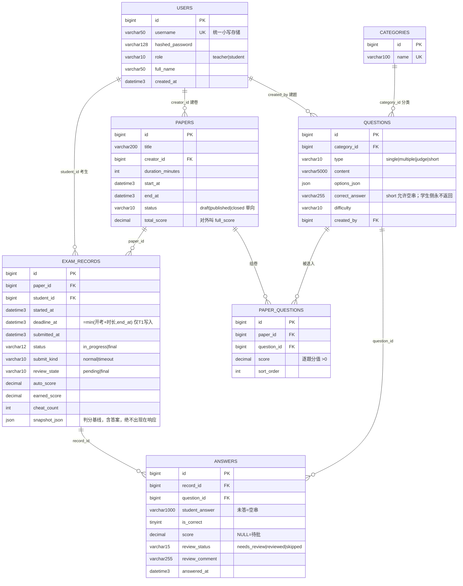

# 在线考试系统 · exam_system

> 第三个实战项目（① FastTask → ② 短链服务 → **③ 在线考试系统**）。
> 从零实现的教育场景后端：RBAC 权限、四种题型的判分引擎、Redis 驱动的限时交卷、幂等防重复提交。
> 定位是**真实可用的业务系统**（可给本校师生试用），不是只读 demo。

- 技术栈：Python 3.12.13 + FastAPI + SQLAlchemy 2.0 + Alembic + MySQL 8.0.46 + 原生 Redis 5.0.14.1
- 规模：`app/` 约 2200 行、`tests/` 约 2000 行；**118 个用例全绿**，`app.services` 覆盖率 **94.85%**
- 文档：`docs/D1-需求文档.md`（v1.2）·`docs/D2-开发文档.md`（v1.2）·`docs/D3-测试文档.md`·`docs/D4-项目最终报告.md`

---

## 1. 角色说明

| 角色 | 能做什么 | 不能做什么 |
|---|---|---|
| **老师 teacher** | 建分类/题库、手动组卷（逐题设分值）、发布与关闭试卷、**读学生作答并批改简答题**、看全班成绩与统计 | 不能替学生考试；不能改**已被已发布试卷引用**的题目内容（判分基准保护）；看不到别的老师创建的试卷的统计（404） |
| **学生 student** | 看已发布考试、开考（服务端限时）、逐题作答（支持断点续考）、交卷、查自己成绩与记录列表、上报切屏 | 看不到任何正确答案与参考答案（自动化用例守这条）；不能建题/组卷/看统计（403）；不能访问他人记录（404） |
| **未认证** | 注册、登录、`/health` | 其余一律 401 |

注册时选角色；**注册 teacher 必须带注册码**（`TEACHER_REGISTER_CODE`），否则 403——防止任何人自建教师账号看全班成绩。

权限判定顺序固定：**401 → 403（角色不符）→ 404（资源不归属/不可见）→ 400/409（业务规则）**。
跨用户资源一律 404 且与"资源不存在"返回完全同形，避免自增 ID 被顺序探测。

## 2. 目录结构

```
项目三实战在线考试系统/            ← git 仓库根
├── docs/                          # D1 需求 / D2 开发 / D3 测试 / D4 报告 / 手工验证实录
└── exam_system/
    ├── app/
    │   ├── main.py            # 入口：路由挂载顺序、/health、日志、异常处理器
    │   ├── config.py          # .env 读取（缺 SECRET_KEY 直接给可复制的修复命令）
    │   ├── database.py        # engine / SessionLocal / get_db
    │   ├── models.py          # 7 张表
    │   ├── schemas.py         # Pydantic 入参校验 + 响应白名单
    │   ├── security.py        # bcrypt、JWT、角色依赖
    │   ├── redis_client.py    # 会话与提交标记（protocol=2 是硬要求）
    │   ├── time_utils.py      # 单点时钟：全项目唯一 now()，测试在此注入假时间
    │   ├── exceptions.py      # AppError + 统一错误体（含 422 渲染）
    │   ├── services/          # question / paper / exam / grade / stats
    │   └── routers/           # auth / questions / papers / exams / stats
    ├── alembic/               # 迁移（S2 起每步一个增量 revision）
    ├── scripts/
    │   ├── start_redis.ps1    # 起本机原生 Redis（固定 cwd，防 dump.rdb 落中文路径）
    │   ├── seed.py            # 演示数据集：2 老师 + 40 学生 + 12 题 + 1 卷 + 35 条记录
    │   └── verify_api.ps1     # 30 步 curl.exe 端到端实录（输出进 docs/手工验证实录.txt）
    ├── tests/
    │   ├── unit/              # 53 例，零 MySQL/Redis，0.58 秒跑完
    │   └── integration/       # 65 例，真实 MySQL(exam_test) + 真实 Redis(db1)
    ├── requirements.txt       # 精确锁版本（沿用项目一实测可跑组合）
    └── .env.example
```

## 3. 数据模型（ER）



关键索引（每条都有理由，写在 D2 §4）：

| 表 | 索引 | 为什么 |
|---|---|---|
| `exam_records` | `UNIQUE(paper_id, student_id)` | 一人一卷只能一条记录，防重的**数据库兜底** |
| `exam_records` | `INDEX(status, deadline_at)` | 惰性清算按"进行中 + 到期"扫描 |
| `exam_records` | `INDEX(student_id, started_at)` | `GET /api/exams`（我的记录）排序分页 |
| `answers` | `UNIQUE(record_id, question_id)` | 同题反复保存 = upsert，左前缀又覆盖"按记录取全部作答" |
| `paper_questions` | `UNIQUE(paper_id, question_id)` | 防重复加题；左前缀替代需求文档要求的 `paper_id` 普通索引 |
| `questions` | `INDEX(category_id, type)` | 组卷/抽题按"分类+题型"过滤（EXPLAIN 可验证，见 TC-S） |

> 注意：`created_by`、`question_id` 这类**单列外键没有再建显式索引**——InnoDB 会自动为外键建索引，重复声明不仅冗余，实测还会让 `alembic downgrade` 报 `1553 Cannot drop index ... needed in a foreign key constraint`。

## 4. 快速启动（Windows PowerShell）

```powershell
cd "D:\全栈开发\项目三实战在线考试系统\exam_system"

# 1) 虚拟环境（uv 托管的 3.12.13 不被 `py -3.12` 选择器命中，要用完整选择器）
py -V:Astral/CPython3.12.13 -m venv .venv
Set-ExecutionPolicy -Scope Process -ExecutionPolicy RemoteSigned
.\.venv\Scripts\Activate.ps1
python -m pip install -i https://pypi.tuna.tsinghua.edu.cn/simple -r requirements.txt

# 2) 起 Redis（本机原生 5.0.14.1，默认不运行；这台机器没有 Docker）
powershell -File scripts\start_redis.ps1

# 3) 建库（Alembic 不能建库，必须先 CREATE DATABASE；客户端默认 gbk，必须带字符集参数）
mysql -h 127.0.0.1 -P 3307 -uroot -p --default-character-set=utf8mb4 -e "CREATE DATABASE IF NOT EXISTS exam_db CHARACTER SET utf8mb4 COLLATE utf8mb4_unicode_ci; CREATE DATABASE IF NOT EXISTS exam_test CHARACTER SET utf8mb4 COLLATE utf8mb4_unicode_ci;"

# 4) 配置与迁移
copy .env.example .env    # 填 DATABASE_URL / TEST_DATABASE_URL / SECRET_KEY / TEACHER_REGISTER_CODE
alembic upgrade head

# 5) 启动 + 演示数据
uvicorn app.main:app --reload --port 8000
python scripts\seed.py --reset

# 6) 交互式文档：http://127.0.0.1:8000/docs
```

三个 Windows 特有的坑，踩之前先看：

1. **PowerShell 里 `curl` 是 `Invoke-WebRequest` 的别名**，必须写 `curl.exe`；
2. **PowerShell 5 默认按 GBK 解码子进程输出**，脚本里要 `[Console]::OutputEncoding = [Text.Encoding]::UTF8`，否则中文响应全是"楠岃瘉"这种乱码（不是服务端的错）；
3. **`alembic.ini` 只能是纯 ASCII**：Alembic 用 `encoding="locale"`（中文 Windows = GBK）读它，写中文注释会 `UnicodeDecodeError` 直接起不来。

## 5. API 一览与 curl 示例

错误统一体：`{"code": "ALREADY_SUBMITTED", "message": "英文短语", "detail": "中文说明/结构化数据"}`。

| 分类 | 方法与路径 | 角色 |
|---|---|---|
| 认证 | `POST /api/auth/register`、`POST /api/auth/token` | 未认证 |
| 题库 | `POST/GET /api/categories`、`POST/GET /api/questions`、`GET/PUT/DELETE /api/questions/{id}` | teacher |
| 试卷 | `POST/GET /api/papers`、`GET /api/papers/{id}`、`POST /api/papers/{id}/publish`、`/close` | teacher（列表学生可看自己的） |
| 考试 | `POST /api/exams/{paper_id}/start`、`GET /api/exams`、`GET /api/exams/{record_id}`、`POST /api/exams/{record_id}/answer`、`/submit`、`/cheat-report` | student |
| 成绩 | `GET /api/exams/{record_id}/score` | 本人或该卷创建老师 |
| 批改 | `GET /api/exams/{record_id}/answers`、`POST /api/exams/{record_id}/review` | 仅创建者老师 |
| 统计 | `GET /api/papers/{id}/results`、`GET /api/papers/{id}/stats` | 仅创建者老师 |
| 健康 | `GET /health` | 未认证，恒 200 |

本期**故意不提供** `PUT/DELETE /api/papers/{id}`：试卷一旦发布，题集与每题分值不可变，没有接口就没有破坏判分基准的后门。

<details>
<summary>核心链路 curl 实录（完整 30 步见 docs/手工验证实录.txt）</summary>

```bash
# 教师注册（注册码来自 .env）→ 登录
curl.exe -s -X POST http://127.0.0.1:8000/api/auth/register \
  -H "Content-Type: application/json" \
  --data "{\"username\":\"teacher01\",\"password\":\"Passw0rd!\",\"role\":\"teacher\",\"teacher_code\":\"TC0DE-EXAM\"}"
# {"id":1,"username":"teacher01","role":"teacher","full_name":null}

TOKEN=$(curl.exe -s -X POST http://127.0.0.1:8000/api/auth/token \
  -H "Content-Type: application/json" --data '{"username":"teacher01","password":"Passw0rd!"}' \
  | python -c "import sys,json;print(json.load(sys.stdin)['access_token'])")

# 学生开考：返回题面（无答案）+ 服务端剩余时间
curl.exe -s -X POST http://127.0.0.1:8000/api/exams/1/start -H "Authorization: Bearer $STU"
# {"record_id":36,"remaining_seconds":599,"deadline_at":"2026-09-20T21:55:32.125000",
#  "questions":[{"question_id":13,"type":"single","score":5.0,"content":"验证题1 单选","options":[...]}],...}

# Redis 会话 TTL 实测 = 600 时长 + 30 宽限
D:\Redis\redis-cli.exe -n 0 TTL exam:session:36      # => 629

# 交卷判分（多选乱序 ["C","A"] 自动归一为 A,C 并判对）
curl.exe -s -X POST http://127.0.0.1:8000/api/exams/36/submit -H "Authorization: Bearer $STU"
# {"status":"final","submit_kind":"normal","auto_score":30.0,"full_score":50.0,
#  "pending_review_count":1,"review_state":"pending"}

# 第二次提交被拒，且带回首次成绩
curl.exe -s -X POST http://127.0.0.1:8000/api/exams/36/submit -H "Authorization: Bearer $STU"
# {"code":"ALREADY_SUBMITTED","detail":{"record_id":36,"submitted_at":"...","earned_score":30.0}}

# 老师读作答 → 批改 18 分 → 记录定稿
curl.exe -s http://127.0.0.1:8000/api/exams/36/answers -H "Authorization: Bearer $TOKEN"
curl.exe -s -X POST http://127.0.0.1:8000/api/exams/36/review -H "Authorization: Bearer $TOKEN" \
  -H "Content-Type: application/json" --data '{"question_id":16,"score":18,"comment":"要点齐全"}'
# {"earned_score":48.0,"pending_review_count":0,"review_state":"final"}
```
</details>

## 6. 核心机制（一句话版）

| 机制 | 做法 |
|---|---|
| **限时** | 开考时 `deadline_at = min(开考+时长, 试卷结束)` 落库且**永不更新**；Redis 用 `SET exam:session:{rid} <json> EX <ttl>` 原子带过期；剩余时间**由 DB 算**，Redis 只负责判活 |
| **超时** | 没有定时任务（需求文档禁调度组件）→ **惰性清算**：学生查成绩 / 老师查成绩统计 / 同卷开考时，把"进行中且已过宽限"的记录按已保存答案补判为 `submit_kind=timeout`，**照常进统计** |
| **防重复提交** | 权威是 **DB 条件更新** `UPDATE ... WHERE id=? AND status='in_progress'`（`rowcount==1` 才有判分权）；Redis `EXISTS exam:submit:{rid}` 只是双击快速失败；`UNIQUE(paper_id,student_id)` 兜底防重复开考 |
| **判分** | 单选/判断字符串严格相等；多选**集合全等**（少选/错选/多选一律 0 分）；简答不自动判——已答进 `needs_review`，未答直接 `skipped` 0 分定稿 |
| **判分基准** | 开考瞬间把"题集+每题分值+正确答案"冻结进 `exam_records.snapshot_json`；题目被已发布试卷引用后内容锁定（409）→ 迟到的清算不会用"改后的答案"判分 |
| **续考** | 每题 upsert 落库；`GET /api/exams` 找回记录；会话丢失时按 DB 剩余时间重建（TTL 只减不增） |

## 7. 测试

```powershell
# 单元（不连 MySQL/Redis，0.58 秒）
.venv\Scripts\python.exe -m pytest tests/unit -q

# 全量（集成用 exam_test 库 + Redis db1，跑之前必须先起 Redis）
.venv\Scripts\python.exe -m pytest -q
# 118 passed

# 覆盖率：services 卡 80% 门槛，整体只报告
.venv\Scripts\python.exe -m pytest --cov=app.services --cov-fail-under=80 -q   # 实得 94.85%
.venv\Scripts\python.exe -m pytest --cov=app --cov-report=term-missing -q      # 实得 96%

# 手工端到端（需要 uvicorn 在 8000 端口）
powershell -File scripts\verify_api.ps1     # 写入 docs/手工验证实录.txt
```

约定：**环境不通 = fail-fast 报错并打印启动命令，不算 skip**。集成测试故意用真 MySQL/真 Redis，
因为 `utf8mb4_unicode_ci` 大小写不敏感、`ONLY_FULL_GROUP_BY`、Redis TTL 的 `-1/-2` 语义这些只在真组件上暴露。

用例构成（明细见 `docs/D3-测试文档.md`）：单元 53（判分矩阵、时间纯函数、题型校验）+
集成 65（RBAC、题库、组卷、考试流、提交批改、超时清算、统计、泄露与静态检查）。

## 8. 已知限制

1. **无前端**（需求文档 P2 后置），全部能力走 HTTP API；切屏上报接口已实现但没有页面触发方。
2. **时间用服务端本地 naive datetime**，单机部署不做时区换算；`DATETIME(3)` 保毫秒。
3. **JWT 无刷新、无登出黑名单**，有效期 240 分钟（必须 ≥ 最长考试时长 + 宽限，否则学生交不了卷）。
4. **题库全局共享**：任何老师可增删未锁定的题；只有"被已发布试卷引用"才锁内容与分值。
5. **教师注册码是单值环境变量**，不是邀请/审批体系；换码需改 `.env` 重启。
6. **惰性清算意味着成绩不"准时"**：超时学生不再访问、老师也不看统计时，记录会停在 `in_progress`（数据仍完整，一旦被读到立刻补判）。
7. **Redis 无 AOF（`appendonly no`）**，重启会丢会话与提交标记——已由 DB 事实源兜底，不丢正确性。
8. 随机抽题组卷、提交限流、试卷缓存均为 P1 预留，**本期只有接口设计没有实现**。
9. 密码只校验长度 8~64，无复杂度/历史校验；登录失败不区分"用户不存在/密码错"以防枚举，但注册接口仍会告知用户名占用（练手项目权衡）。
10. 单机单实例规模（≤ 百人考试）设计，未考虑分库分表、分布式锁与多实例并发清算的选型（DB 条件更新天然支持多实例，但没有压测数据支撑）。

## 9. 后续计划

**本项目内可做**：随机抽题组卷（`SELECT id` + `random.sample`，避开 `ORDER BY RAND()`）、Excel 题库导入导出、简答题关键字预评分、成绩导出 CSV、Vue3 前端 + 真实倒计时、批量批改页。

**架构演进**：Redis keyspace notification / 延迟队列做准实时自动交卷（替代惰性清算）、多实例部署下的会话共享与限流、审计日志与权限体系细化到班级、题目乱序与选项乱序防作弊。
